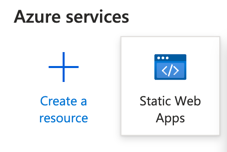
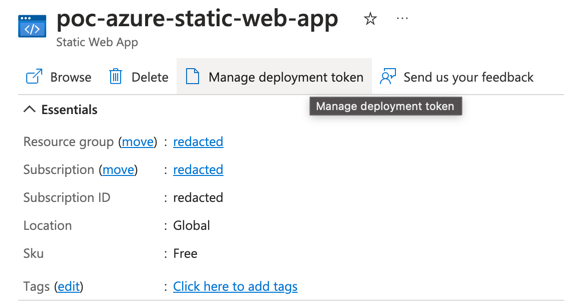
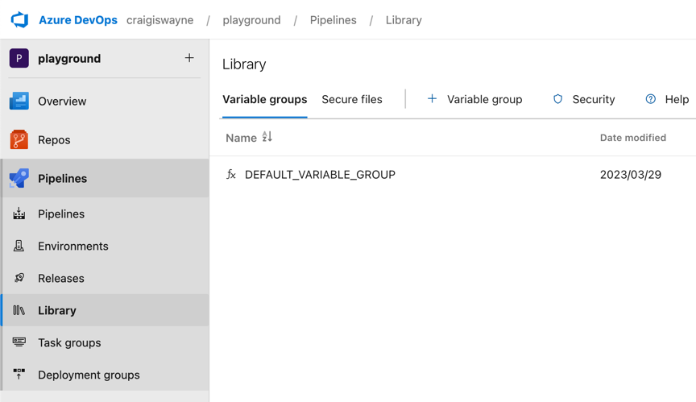
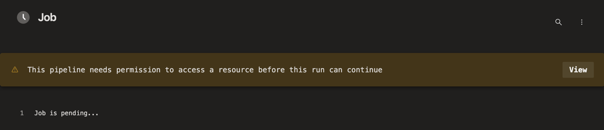
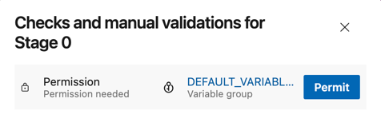
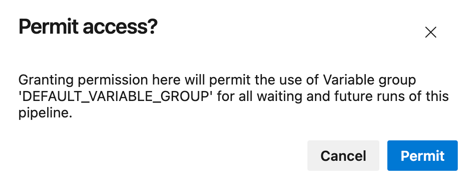

# Angular Playground

This branch illustrates how to deploy an angular app to Azure Static Web Apps via an Azure pipeline

## Prerequisites for Simple Pipeline
1. [Create an Azure Portal Static Web App](https://portal.azure.com)
   
2. You'll need the deployment token from this static web app created
   
3. Setup a pipeline variable group
   
4. Allow the pipeline to access variable groups (first-run only)
   
   
   

### Pre-requisites for Multi-Stage Pipeline
1. Create an Environment name 'production'

### Pipelines
There are two ways to do this:
1. Using a stage-less pipeline (simple)
2. Using a multi-stage pipeline

you can find these files in the `azure-pipelines` folder

#### Steps
The following steps are performed in the pipeline
1. Setup Node Environment
2. Setup Node Cache
3. NPM Install
4. NPM Lint
5. NPM Build
6. 

### TODO
1. Deploy a static web app resource from your pipeline (arm templates)
5. artifact name to specify prod or uat
6. Any step with a condition needs to have the succeeded shit
   8. `  condition: and(succeeded(), eq(variables.isMain, true))`
9. clean up variables
10. check for instances of `playground-angular`
